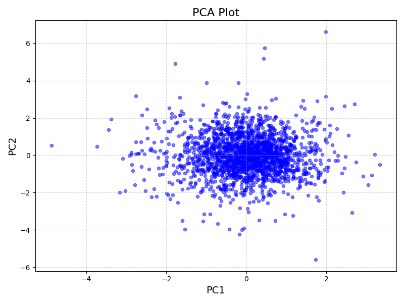
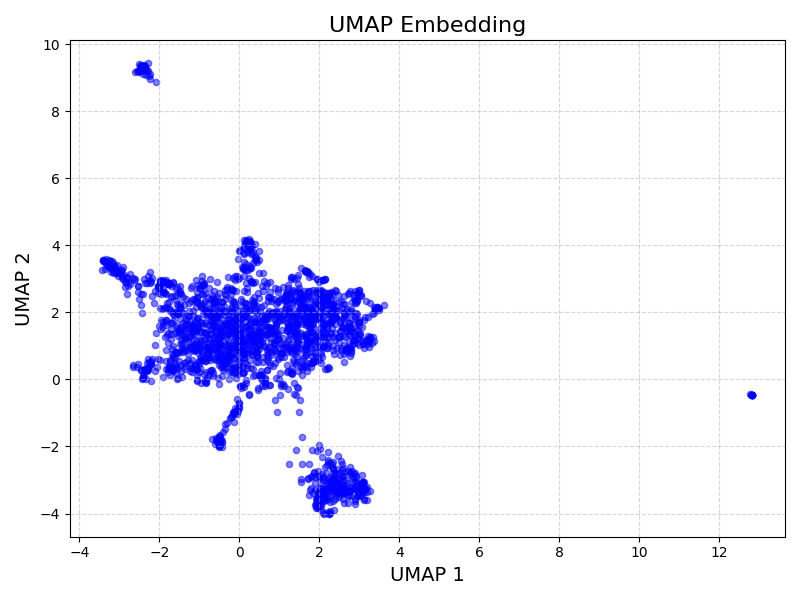

# scPyDR
### Single-Cell Python Dimensionality Reduction
`scPyDR` is a Python package containing tools for the dimensionality reduction and visualization of single-cell RNA sequencing data. The three tools are simpler versions of Scanpy's [`scanpy.pp.pca`](https://scanpy.readthedocs.io/en/stable/generated/scanpy.pp.pca.html), [`scanpy.tl.tsne`](https://scanpy.readthedocs.io/en/stable/generated/scanpy.tl.tsne.html), and [`scanpy.tl.umap`](https://scanpy.readthedocs.io/en/stable/generated/scanpy.tl.umap.html).

[Prerequisites](#Prerequisites) | [Installation](#Installation) | [Basic Usage](#Usage) | [scPyDR Options](#Options) | [File Formats](#Formats) | 
[Contributors](#Contributors)

## Prerequisites<a name="Prerequisites"></a>
`scPyDR` requires the following python libraries to be installed:
* numpy
* pandas
* matplotlib
* anndata
* scanpy
* umap

These can be installed with the following `pip` command:
```
pip install numpy pandas matplotlib anndata scanpy umap
```

*Note: if you do not have root access, the packages can be installed locally with the following command:*
```
pip install --user numpy pandas matplotlib anndata scanpy umap
```

## Installation<a name="Installation"></a>
Once the required libraries are installed, `scPyDR` can be installed with the following commands:
```
git clone https://github.com/isabelwang30/scPyDR.git
cd scPyDR
python setup.py install
```

*Note: if you do not have root access, `scPyDR` can be installed locally with the following commands:*
```
git clone https://github.com/isabelwang30/scPyDR.git
cd scPyDR
python setup.py install --user
```

If the install was successful, the command `scpydr --help` should show a useful help message.

*Note: if you get an error that says the `scpydr` command was not found, you may need to include the script installation path in your `$PATH` variable before calling `scpydr`. You can do this with the following command, replacing `<user>` with your own username:*
```
export PATH=$PATH:/home/<user>/.local/bin
```

## Basic Usage<a name="Usage"></a>
The basic usage of scPyDR is as follows:
```
scpydr [DATADIR] [other options]
```

To run `scPyDR` on a small test example (see `benchmark` in this repo):
```
scpydr benchmark
```

With the same test example, to run `scPyDR`'s PCA and UMAP functions and visualize the UMAP results:
```
scpydr benchmark -u -v
```

Using the `-u` and `-v` flags, this should produce the outputs below:
* `bench_pca.txt` containing a matrix of the original data fitted to the new PCs
* `bench_pca_plot.png`, a PCA plot of the top 2 principal components that explain the most variance in the data
* `bench_umap_plot.png`, a UMAP embedding that visualizes the original high dimensionality data as clusters in 2d

A subset of the first row of bench_pca.txt (produced with `cat bench_pca.txt | head -n 1`) is shown below:

-2.485872704351306806e-01	3.278629287794706526e-01	-4.974904690516801509e-02	-2.280995943388218483e-01	1.091355782633422145e+00	-5.147636707852016880e-01	-3.025261576284558052e-01	1.694834094170140970e+00	1.013115422083780581e+00	3.830966522765476556e-01	-3.424854126011628863e-01	-2.094369525383048269e-01	3.460090229111213445e-01	-2.390959406379772334e-01	1.511715243605225023e+00	2.830518342390779818e-01	2.328261578890405303e+00	-9.110100359570278972e-01	-9.028077130107781123e-02	1.804449045426805287e-01	-2.967579654217715301e+00	-1.478190878265270625e+00	1.114987532913222168e+07.993442951791249751e-01	6.060254848789651261e-01	1.892703178566460753e+01.114046066780256306e+00	5.713761410348723313e-01	-1.013362693959214411e+00	4.219840568937338610e-02	-3.975902628616227452e-01	-2.536153511052334775e-01	6.964005476023847896e-01	-2.051732831674646373e-02	3.209980374343705534e-01	1.448234261533591916e-01	-1.629999394824266590e+00	-4.962272419010332336e-01	-1.678736208950689646e-01	1.664218502251575693e-01	4.038909615284903554e-01	-2.168256013057007436e+00	-3.663763210311925533e-01	2.166114603329553079e-0-2.644971396985659196e-01	7.912143316699211670e-01	1.419106095142732338e+00	-1.152433140440520531e-01	-7.214509157322808175e-01	6.300902323015380446e-01	-1.730830558869007330e-01	-2.021795038932240551e+00	-6.118948032620941113e-01	-3.093894107306541241e-01	-1.372640337942624411e+00	-5.025003443563974548e-01	1.189065590775424175e+0-9.045634873980148427e-01	1.341147761557781148e+00	3.322970350985598453e-01	-1.137614561843686423e-01	9.500605376224705578e-01	1.673235669971768758e+00	-1.164624655965840333e-01	-7.408905469747523176e-02

The plots for PCA and UMAP from the benchmark dataset are shown below. 
*Note: because UMAP is a stochastic process, the graph may have global differences. In other words, the local clusters will look similar, but they may be placed in different locations on the plot.*



## scPyDR Options<a name="Options"></a>
scPyDR requires the following input file:
* `[DATADIR]`: Directory containing 10x Genomics scRNA-seq data files. See below for format specifications on the 10x Genomics data files.

Additional options include:
* `-o`, `--output` `[OUTDIR]`: Output directory to store results. Default: working directory.
* `-g`, `--min_genes` `[INT]`: Minimum number of genes expressed per cell. Default: 200.
* `-c`, `--min_cells` `[INT]`: Minimum number of cells expressing a gene. Default: 5.
* `-cr`, `--min_cell_reads` `[INT]`: Minimum number of reads per cell. Default: None.
* `-gc`, `--min_gene_counts` `[INT]`: Minimum number of counts per gene. Default: None.
* `-ntop`, `--n_top_genes` `[INT]`: Number of highly variable genes to keep. Default: 500.
* `-t`, `--target_sum` `[FLOAT]`: Number of reads per cell for normalization. Default: 1e4.
* `-n`, `--nComp` `[INT]`: Number of principal componenets. Default: for n data points and m features, there are min(n-1,m) PCs.
* `--version`: Print the version of scPyDR.
* `-u`, `--umap`: Run UMAP for dimensionality reduction and visualization.
* `-v`, `--visualize`: Visualize the results of scPyDR.

## File Formats<a name="Formats"></a>
The input file should be a count matrix from `10X cellranger`'s `cellranger count` analysis pipeline. A widely-used source to publish and find such count matrices from scRNA-seq data is [GEO](https://www.ncbi.nlm.nih.gov/geo/). The benchmarking data for this package was found on GEO. Read more on the count matrix file format [here](https://www.10xgenomics.com/support/software/cell-ranger-arc/latest/analysis/feature-barcode-matrices). 

*Note: To run scPyDR, the barcodes and features matrices should be loaded as gzip files and placed into a single directory. Use the name of this directory (as a `str`) as the input to scPyDR.*

## Contributors<a name="Contributors"></a>
This repository was generated by Anushka Sheoran, Isabel Wang, and Monica Park with inspiration from the [mypileup](https://github.com/gymreklab/cse185-demo-project#readme) project demo and the projects of peers. If any issues should arise, please submit a pull request with any corrections or suggestions. Thank you!
