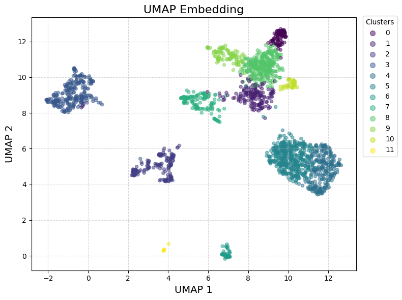

# scPyDR
### Single-Cell Python Dimensionality Reduction
`scPyDR` is a Python package containing tools for the dimensionality reduction and visualization of single-cell RNA sequencing data. The two tools are simpler versions of Scanpy's [`scanpy.pp.pca`](https://scanpy.readthedocs.io/en/stable/generated/scanpy.pp.pca.html) and [`scanpy.tl.umap`](https://scanpy.readthedocs.io/en/stable/generated/scanpy.tl.umap.html).

*Note: `scPyDR`'s UMAP tool runs independent of `scPyDR`'s PCA tool for benchmarking purposes. It uses `scanpy.pp.pca`, [`scanpy.pp.neighbors`](https://scanpy.readthedocs.io/en/stable/api/generated/scanpy.pp.neighbors.html), and [`sc.tl.leiden`](https://scanpy.readthedocs.io/en/stable/generated/scanpy.tl.leiden.html) to perform dimensionality reduction and clustering.*

Currently, `scPyDR` only supports the analysis of a single set of scRNA-seq data. Please see [scPyDR Options](#Options) and [File Formats](#Formats) for more information.

[Prerequisites](#Prerequisites) | [Installation](#Installation) | [Basic Usage](#Usage) | [scPyDR Options](#Options) | [File Formats](#Formats) | 
[Contributors](#Contributors)

## Prerequisites<a name="Prerequisites"></a>
`scPyDR` requires the following python libraries to be installed:
* numpy
* pandas
* matplotlib
* anndata
* scanpy
* umap
* leidenalg

These can be installed with the following `pip` command:
```
pip install numpy pandas matplotlib anndata scanpy umap leidenalg
```

*Note: if you do not have root access, the packages can be installed locally with the following command:*
```
pip install --user numpy pandas matplotlib anndata scanpy umap leidenalg
```

## Installation<a name="Installation"></a>
Once the required libraries are installed, `scPyDR` can be installed with the following commands:
```
git clone https://github.com/isabelwang30/scPyDR.git
cd scPyDR
python setup.py install
```

*Note: if you do not have root access, `scPyDR` can be installed locally with the following commands:*
```
git clone https://github.com/isabelwang30/scPyDR.git
cd scPyDR
python setup.py install --user
```

If the install was successful, the command `scpydr --help` should show a useful help message.

*Note: if you get an error that says the `scpydr` command was not found, you may need to include the script installation path in your `$PATH` variable before calling `scpydr`. You can do this with the following command, replacing `<user>` with your own username:*
```
export PATH=$PATH:/home/<user>/.local/bin
```

## Basic Usage<a name="Usage"></a>
The basic usage of scPyDR is as follows:
```
scpydr [DATADIR] [other options]
```

To run `scPyDR` on a small test example (see `benchmark/data` in this repo):
```
scpydr benchmark/data
```

With the same test example, to run `scPyDR`'s PCA and UMAP functions:
```
scpydr benchmark/data -u
```

Using the `-u` flag, this should produce the outputs below:
* `data_pca.txt` containing a matrix of the original data fitted to the new PCs
* `data_pca_plot.png`, a PCA plot of the top 2 principal components that explain the most variance in the data
* `data_umap_plot.png`, a UMAP embedding that visualizes the original high dimensionality data as clusters in 2d

A subset of the first row of benchmark_pca.txt (produced with `cat data_pca.txt | head -n 1`) is shown below:

-1.219651175379992569e+00       6.347092843840126397e-01        2.027305610399767477e-01        -2.803473111483573810e+00     -1.714817537238526146e+00       8.638381501631499371e-02        1.062654968245341780e-01        -2.534042243052277321e+00     3.133832692251309893e-01        -3.090336782067153454e-01       2.307744277491030171e+00        -1.864360114156933257e-01     -6.550224765112774294e-01       -5.911898444561517474e-01       -4.995681008765330278e-01    7.358296476335741687e-01 -3.882210850330847229e-02       2.325693856623583522e-01        -9.621457267116122480e-01    6.094084032488079616e-01 5.809506945609355100e-01        -5.377958204574021517e-01       -5.736244394191321039e-01    -1.053734274308523400e+00        1.202608425858034735e+00        1.099484793472616850e+00        -5.583842415508543100e-01     7.165800657872374302e-01        -6.406463601142169395e-01       1.739142153271877600e+00        1.017837341541046881e+00      3.104882071587936609e-01        9.257044271902127308e-01        4.916145353522260453e-01        1.388882058282096210e+00      1.150715506217820039e+00        9.995956940623004217e-01        7.362629783144015727e-01     3.783095504935519715e-01 8.314976429007380210e-01        -7.011155732554025244e-02       -1.476198849609394070e+00    1.402970631186186035e+00 -5.277030063514125402e-01       -4.900406427198634729e-01       -6.710851577836234316e-01    -2.326839880301993624e+00        1.348014237802151460e-01        4.496566583885364121e-01

The plots for PCA and UMAP from the benchmark dataset are shown below. 

*Note: because UMAP is a stochastic process, the graph may have global differences. In other words, the local clusters will look similar, but they may be placed in different locations on the plot.*




## scPyDR Options<a name="Options"></a>
scPyDR requires the following input file:
* `[DATADIR]`: Directory containing 10x Genomics scRNA-seq data files. See below for format specifications on the 10x Genomics data files.

Additional options include:
* `-o`, `--output` `[OUTDIR]`: Output directory to store results. Default: working directory.
* `-g`, `--min_genes` `[INT]`: Minimum number of genes expressed per cell. Default: 200.
* `-c`, `--min_cells` `[INT]`: Minimum number of cells expressing a gene. Default: 5.
* `-cr`, `--min_cell_reads` `[INT]`: Minimum number of reads per cell. Default: None.
* `-gc`, `--min_gene_counts` `[INT]`: Minimum number of counts per gene. Default: None.
* `-ntop`, `--n_top_genes` `[INT]`: Number of highly variable genes to keep. Default: 500.
* `-t`, `--target_sum` `[FLOAT]`: Number of reads per cell for normalization. Default: 1e4.
* `-n`, `--nComp` `[INT]`: Number of principal componenets. Default: for n data points and m features, there are min(n-1,m) PCs.
* `--version`: Print the version of scPyDR.
* `-u`, `--umap`: Run UMAP for dimensionality reduction and visualization.

## File Formats<a name="Formats"></a>
The input files should be the `features.tsv.gz`, `barcodes.tsv.gz`, and `matrix.mtx.gz` files from `10x cellranger`'s `cellranger count` analysis pipeline. A widely-used source to publish and find such count matrices from scRNA-seq data is [GEO](https://www.ncbi.nlm.nih.gov/geo/). The benchmarking data for this package was found on GEO. Read more on the count matrix file format [here](https://www.10xgenomics.com/support/software/cell-ranger-arc/latest/analysis/feature-barcode-matrices). 

*Note: To run scPyDR, the barcodes, features, and matrix files should be loaded as gzip files and placed into a single directory. Use the name of this directory (as a `str`) as the input to scPyDR.*

## Contributors<a name="Contributors"></a>
This repository was generated by Anushka Sheoran, Isabel Wang, and Monica Park with inspiration from the [mypileup](https://github.com/gymreklab/cse185-demo-project#readme) project demo and the projects of peers. If any issues should arise, please submit a pull request with any corrections or suggestions. Thank you!
