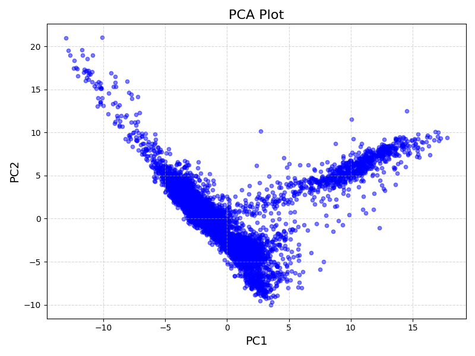

# Analysis

The nested directory `analysis/data` contains a subset of a GEO public dataset (healthy mouse colon sample GSM8217725) that was analyzed through scPyDR. These files were downloaded from the paper: [Single-cell RNA sequencing of healthy mouse colon and mouse colon with acute or chronic colitis induced by DSS](https://www.ncbi.nlm.nih.gov/geo/query/acc.cgi?acc=GSE264408).

From the root directory, scPyDR was run on these files using the following command:
```
cd analysis
mkdir results
scpydr data -o results
```

This creates the nested directory `analysis/results` containing the following results of scpydr:
* `data_pca_plot.png`: a plot of the data projected onto the top 2 principal components
* `data_pca.txt`: a text file containing a matrix of the original data projected onto the newly computed principal components

A subset of data_pca.txt (generated by `cat results/data_pca.txt | head -n 1`) is shown below, but not included in the repository due to storage restrictions.

-4.808124686502586453e-02       6.473649532047754951e-01        -4.067409865243430955e-01       -7.141831491527551867e-02       2.332987958434422082e-01        6.940688138737630686e-01     -2.291327429831329920e-01       1.757803252749530476e-02        4.722958215909442981e-01        -9.974986153057727178e-02       1.719137353471817953e-01    -1.122488980859313701e+00        -4.840469897737071509e-02       -8.529311311404309814e-02       -3.478837942160634134e-01       1.686936822412890224e+00        1.873108117169653974e-01     4.300121065843959811e-01        -4.369850724191758351e-01       -7.398008847231498653e-01       -8.389284963889731550e-02       -3.960444740168448940e-01   -5.478339341598534862e-01        2.282600151691449863e-01        -3.981561304635966581e-01       -1.255505004941281033e+00       -7.616908164713120932e-02       7.072934349943676979e-02     -1.832827670163828804e-01       -1.025540053959466125e-01       1.314402658277209035e+00        -3.241664779815821018e-01       -9.493066110864982476e-02   4.047117895585035652e-01 -4.688286684456416387e-01       -7.313809798104867199e-02       -2.031945230796795565e-01       -9.295551079211915313e-02       2.120814698713273938e-01     1.793382999049172866e-01        2.084607991874696253e-01        3.130930953041366482e-02        -1.377886807817268189e-01       1.274259132821581597e-01        -3.374751804926769405e-01    3.220515355632458943e-01        5.837823549419427493e-01        -4.964439188502599576e-01       -2.030947752527016703e-02       1.085781948395214025e+00     5.668595434925396415e-01        3.154097898572746361e-01        5.737645181418357110e-01        -3.265922850311946818e-02       2.185734321722272000e+00        -4.667887622945562920e-01    -2.356773886403232821e-01       4.842499221323573466e-01        5.405669251832181388e-01        7.521497758866725614e-02        8.318743216335439117e-01     6.385496668421781763e-01        1.333611484481943832e-01        1.592009781277130276e-02        -1.284353012153401474e+00       -4.280497766800266390e-01       2.128423930843207079e-01     -4.027055612092349524e-01       9.211720286469008423e-01

The plot for PCA is shown below:

