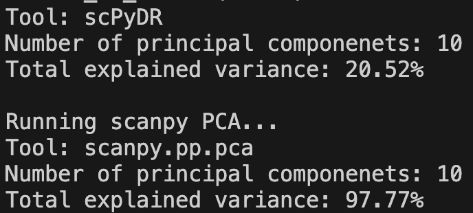

# Benchmarking scPyDR against scanpy PCA and UMAP
We have created two bash scripts to benchmark our tools against Scanpy's versions, running on the data found in `benchmark/data` (see its [README](https://github.com/isabelwang30/scPyDR/tree/main/benchmark/data#readme) for further details).

## `time.sh`
For both PCA and UMAP separately, this script benchmarks the **time it takes to run** scPyDR's version vs. Scanpy's version, as well as the **plots generated** by the two tools. It uses the python scripts `scanpy_pca.py`, `scanpy_umap.py`, and `scPyDR_umap.py`.

The script can be run with the following command from within the scPyDR directory:

```
bash benchmark/time.sh
```
**Outputs**

The time it takes to run each tool will be printed to the terminal. The actual time it takes can be calculated by taking the sum of "user" and "sys" times. Here is a summary of the total time it took to run each tool in our case:

| Tool        | Total Time |
|-------------|------------|
| scPyDR PCA  | 8.784s    |
| Scanpy PCA  | 16.36s    |
| scPyDR UMAP | 48.715s    |
| Scanpy UMAP | 42.605s    |

The plots generated by scPyDR's versions of the tools will be saved to a new `benchmark/scpydr_results` directory. The plots generated by Scanpy's versions of the tools will be saved to a new `figures` directory. These plots can be compared visually, and the number of clusters visualized by the UMAP tools can be compared.

## `pca_variance.sh`
This script benchmarks the dimensionality reduction of scPyDR's PCA vs. Scanpy's PCA by comparing the **total variance explained** by the top `n=10` components generated by each tool. It uses the python scripts `scanpy_pca_variance.py` and `scpydr_pca_variance.py`.

The script can be run with the following command from within the scPyDR directory:

```
bash benchmark/pca_variance.sh
```
**Outputs**

The total explained variance for each tool, as well as the number of components used for the calculations, will be printed to the terminal.

Here is what our output looks like:

